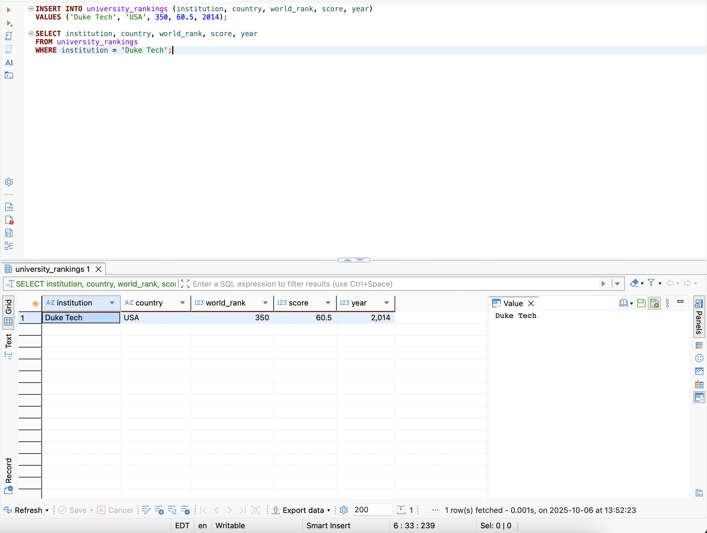
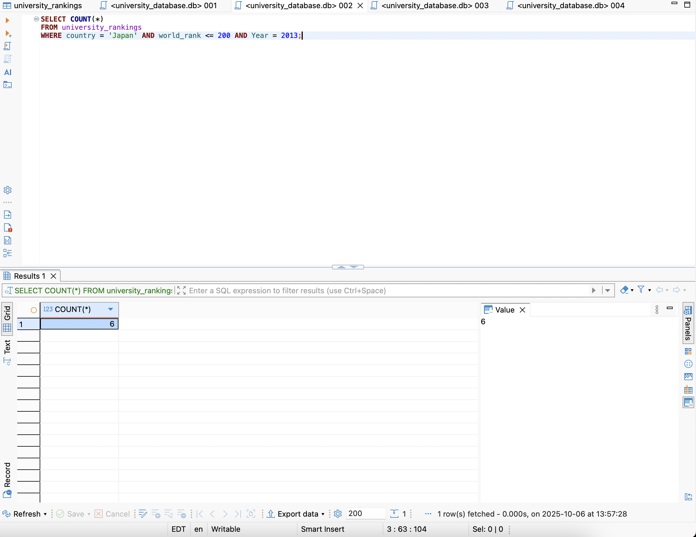
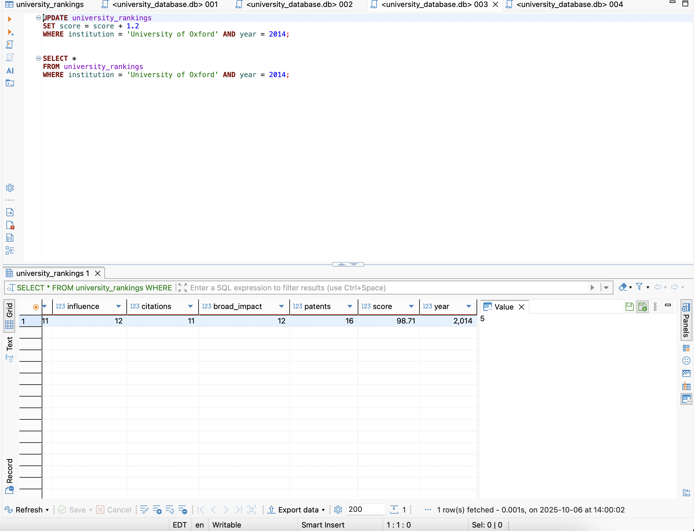
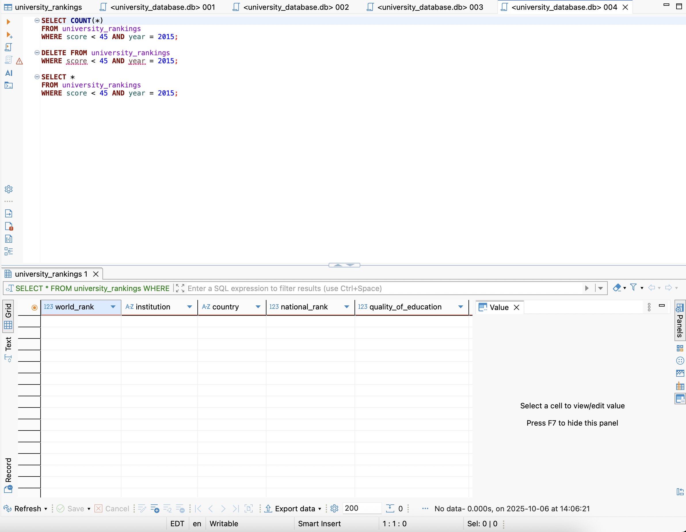

# Week 6 - Mini- Assignment Introduction to Databases

## Overview

This assignment demonstrates working with SQLite to perform basic analysis and CRUD operations on the University Rankings dataset (2012–2015).

**Objectives:**

* Connect to a SQLite database and explore it.
* Perform basic statistical analysis.
* Execute CRUD operations (Create, Read, Update, Delete).
* Document all steps and results with screenshots.


## Repository Structure

```
.
├── images
|   ├── img_00.png  # Basic data analysis
│   ├── img_01.png  # Insert Duke Tech
│   ├── img_02.png  # Count Japanese universities
│   ├── img_03.png  # Update Oxford score
│   └── img_04.png  # Delete low-score universities
├── queries
│   ├── 001.sql     # Insert Duke Tech
│   ├── 002.sql     # Count Japanese universities top 200 2013
│   ├── 003.sql     # Update Oxford score
│   └── 004.sql     # Delete low-score universities 2015
├── readme.md       # This documentation
└── university_database.db  # Pre-built SQLite database
```

---

## 1. Basic Analysis

### 1.1 Total Rows

```sql
SELECT COUNT(*) AS total_rows
FROM university_rankings;
```

* Returns the total number of rows in the dataset.

### 1.2 Maximum, Minimum, and Sum

```sql
SELECT MAX(world_rank) AS max_rank,
       MIN(world_rank) AS min_rank,
       SUM(score) AS total_score
FROM university_rankings;
```

* Identifies the highest and lowest ranks and sums all scores.

### 1.3 Average Score per Year

```sql
SELECT year, AVG(score) AS avg_score
FROM university_rankings
GROUP BY year;
```

* Shows the average score of universities per year (2012–2015).

---

## 2. CRUD Operations

### 2.1 Insert Duke Tech (2014)

**SQL File:** `queries/001.sql`

```sql
INSERT INTO university_rankings (institution, country, world_rank, score, year)
VALUES ('Duke Tech', 'USA', 350, 60.5, 2014);

-- Confirm the operations were made successfully
SELECT *
FROM university_rankings
WHERE institution = 'Duke Tech';
```

A new row was added to the university_rankings table.
Fields added:
* institution = "Duke Tech"
* country = "USA"
* world_rank = 350
* score = 60.5
* year = 2014
This operation did not affect any existing rows.



---

### 2.2 Count Japanese Universities in Top 200 (2013)

**SQL File:** `queries/002.sql`

```sql
SELECT COUNT(*) AS japan_top200
FROM university_rankings
WHERE country = 'Japan' AND world_rank <= 200 AND year = 2013;
```

* This is a Read operation: it does not modify the database.
* Retrieves the number of universities from Japan ranked in the top 200 in 2013.
* Result: 6 universities



---

### 2.3 Update University of Oxford’s Score (2014)

**SQL File:** `queries/003.sql`

```sql
UPDATE university_rankings
SET score = score + 1.2
WHERE institution = 'University of Oxford' AND year = 2014;

-- Confirm the operations were made successfully
SELECT *
FROM university_rankings
WHERE institution = 'University of Oxford' AND year = 2014;
```

* This is an Update operation.
* The score field for the University of Oxford in 2014 was increased by +1.2 points.
* No new rows were added; only one field in one existing row was modified.



---

### 2.4 Delete Low-Score Universities (2015)

**SQL File:** `queries/004.sql`

```sql
-- Check how many rows will be deleted
SELECT COUNT(*) 
FROM university_rankings
WHERE score < 45 AND year = 2015;

-- Delete rows with score below 45
DELETE FROM university_rankings
WHERE score < 45 AND year = 2015;

-- Verify deletion
SELECT *
FROM university_rankings
WHERE score < 45 AND year = 2015;
```

* This is a Delete operation.
* All rows in the 2015 dataset where score < 45 were removed from the table.
* No other rows were affected.

